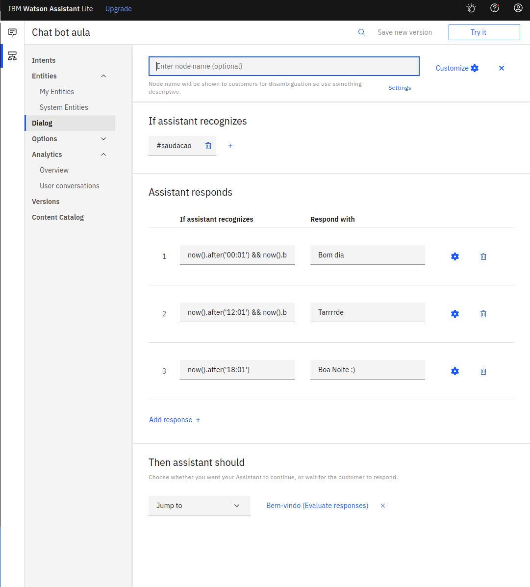

# Trabalho Pos Chat Bot

Alunos:

Pedro Caiafa Marques

Tomás Rosário Rosemberg

Para arvore de dialogo, criamos 7 nós para conseguirmos ter um dialogo fluido que entregue as respostas que queremos.

Para nosso Trabalho, criamos 5 Intents:
- O "Cancelar" para conseguirmos cancelar a operação após entrarmos no prompt para alimentar as variáveis.
- O "Diário" para lidar com dados de cotações de dolar em datas singulares.
- O "Período" para conseguiirmos pegar a variação da cotação de dolar dentro de um período.
- O "Saudação" para conseguirmos saudar o usuário do chatbot.
- O "Tchau" para nos despedirmos do usuário.

- Temos o nó de Boas vindas, com mensagem de boas vindas, indicando as funcionalidades do chatbot. (Este nó não é acionando durante o dialogo inicial do facebook messenger) 

- Por dia é o nó responsavel por lidar com dialogo sobre cotação do dolar em uma data especifica. Nele configuramos o prompt para obtenção de uma variável (data) e um handler para lidar caso queria cancelar antes de inserir esse dado. Com essa variável data, acionamos nossa cloud function via web hook para que possamos fazer uma request e pegarmos a cotação do dolar naquela data.

- Período é o nó responsável por charmar o webhook passando duas datas, para assim responder qual a variação do dólar entre essas duas datas e o seu valor em ambas as datas.

- Nó para indicarmos continuidade na conversa, reapresentando as opções de uso do chatbot. 

- Nó para o chat bot ser capaz de se despedir do usuário.

- Nó de Saudação ao usuário

- Nó para caso não previsto.

